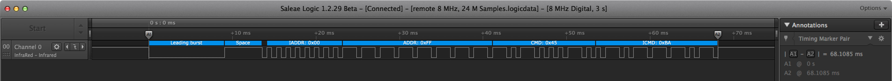
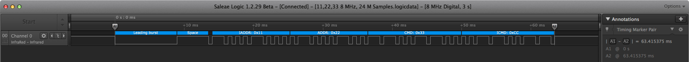
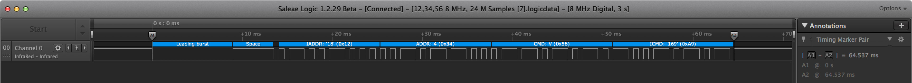

# MicroPython YS-IRTM

MicroPython examples for YS-IRTM 5V NEC Infrared UART transceivers.


Features dual 38KHz 940nm IR TX/RX LEDs and a micro controller which provides a UART interface.

This is a 5V logic device, so if you wish to use with a 3V3 MCU such as the ESP32, you'll need a level shifter or voltage divider.

## Examples

TinyPICO ESP32 > Level shifter > YS-IRTM

```python
import time
from machine import Pin, UART
uart = UART(1, tx=14, rx=15, baudrate=9600)

# sniff for a remote
def sniff():
    while True:
        if uart.any():
            print(uart.readline())

# eg. received b'\x00\xff\x45'

# replay a remote
def replay():
    uart.write(bytearray(b'\xa1\xf1\x00\xff\x45'))
    uart.read()
    # read returns b'\xf1' to say command confirmed

# send a 5 byte packet, return bool if confirmed sent
def tx(buf, timeout_ms=1000):
    uart.write(buf)
    timeout = time.ticks_ms() + timeout_ms
    while time.ticks_ms() < timeout:
        if uart.any():
            resp = uart.read()
            if len(resp) > 0:
                return buf[1] == resp[0]
        time.sleep_ms(20)
    print(buf, 'timeout')
    return False

# send a variable length string by splitting into chunks of 3 data bytes
def send_string(value):
    buf = bytearray(b'\xa1\xf1\x00\x00\x00')
    # pad string to length divisible by 3
    if len(value) % 3:
        value += ' ' * (3 - len(value) % 3)
    for i in range(0,len(value),3):
        buf[2:] = bytes(value[i:i+3],'utf-8')
        while not tx(buf):
            print(buf, 'resend')

# receive a variable length string
# waits for a gap in received packets before printing
def receive_string():
    while True:
        last_size = uart.any()
        if last_size > 0:
            time.sleep_ms(400) # around 270ms each tx
            size = uart.any()
            if last_size == size:
                print(uart.read())
                print(time.ticks_diff(time.ticks_ms(), start))
            else:
                last_size = size
        else:
            time.sleep_ms(20)
            start = time.ticks_ms()

# on device 1
receive_string()

# on device 2
send_string('this is not the most efficient way to send lots of text but it works!')
send_string('abcdefghijklmnopqrstuvwxyz')

# on device 1
# b'this is not the most efficient way to send lots of text but it works!'
# 6402
# b'abcdefghijklmnopqrstuvwxyz '
# 2801

# define something to print when a matching code is detected
cb = {0: {255: {0x45: '1', 0x46: '2', 0x47: '3'}}}

# press a buttons 1, 2 and 3 on a remote
# button 1 = b'\x00\xFF\x45'
# button 2 = b'\x00\xFF\x46'
# button 3 = b'\x00\xFF\x47'
def print_button():
    while True:
        try:
            if uart.any():
                buf = uart.read()
                if len(buf) == 3:
                    print(cb[buf[0]][buf[1]][buf[2]])
                else:
                    print(buf, 'unexpected length')
            time.sleep_ms(20)
        except KeyError:
            print(buf, 'unexpected key')
# prints 1, 2, 3
```

I have a few remotes which work with this IR receiver, see [remotes](remotes.md) for which codes each button sends.

## Pinout

Pin | Name | Description
:--:|:----:|:--------------------------------
1   | GND  | Ground
2   | RXD  | UART receive
3   | TXD  | UART transmit
4   | VCC  | Supply voltage 5V

## Transmit Protocol

Payload consists of 5 bytes and if accepted, the device will reply with the command byte.

If the payload is not understood, the device will not respond. Only the command byte is used as confirmation.

Payload = (Address, Command, Data 1, Data 2, Data 3), eg.

```python
>>> uart.write(bytearray(b'\xa1\xf1\x01\x02\x03'))
>>> print(uart.read())
b'\xf1'
```

The first two bytes (Address + Command) are for instructing the modules microcontroller. The next 3 data bytes are what's actually transmitted.

When you send data `0x00 0xFF 0x45`, what's actually being IR blasted is `0x00 0xFF 0x45 0xBA`. The 4th data byte is automatically appended.

`Leading burst (low), Space (high), Inverse Address (0x00), Address (0xFF), Command (0x45), Inverse Command (0xBA)`

The 4th byte Inverse Command is calculated automatically from the 3rd data byte Command.

Command `0x45` = `0b01000101`, each bit inverted is `0b10111010` = `0xBA` Inverse Command.

There is no validation around the two address bytes (Inverse Address + Address).
The 1st data byte does not have to be the inverse of the 2nd data byte.

If you send `0x11 0x22 0x33`, it's sending `0x11 0x22 0x33 0xCC`. The `0x11` is _supposed to be_ the inverse of `0x22`.
It still sends though. I assume this is to make the module more flexible with different IR protocols.

### Device Address

The device has a feature where you can give the module an address (0-255) and it will ignore UART lines that do not begin with the address.

The default address is `A1` and is changeable with the `F2` command.
If you change the device address, eg to `A2`, then try to send to `A1`, the payload will be ignored.
Resend to `A2` and the payload will be accepted and actioned.

If you change the address, but forget what it is, fear not. There is a failsafe address `FA`.
If you have changed your device address and it's not responding, you can use address `FA` to reset it.
Or just always send to `FA` and ignore the address feature completely.

### Command, Data 1, Data 2 and Data 3

`F1` command to transmit. The 3 data bytes are NEC user code high, user code low, command code.

`F2` command to change address. Data 1 is the new address. Use zeros for Data 2 and 3.

`F3` command to change serial baud rate. Data 1 is the new baud rate (1-4). Use zeros for Data 2 and 3.

Baud rates: `1` = 4800bps, `2` = 9600bps, `3` = 19200bps, `4` = 57600bps.

## Receive Protocol

When the recipient device detects a signal, it will send the 3 data bytes over UART.

Two address bytes and a command byte. The inverse command byte is not sent over UART.

You can receive from a remote that uses the NEC protocol, or from a second YS-IRTM module.

NEC repeat codes are not supported. Holding down a button on a remote does nothing and you only get a single capture.

**Sender YS-IRTM:**

```python
>>> uart.write(bytearray(b'\xa1\xf1\x01\x02\x03'))
>>> print(uart.read())
b'\xf1'
```

**Receiver YS-IRTM:**

```python
>>> print(uart.read())
b'\x01\x02\x03'
```

## Examples

Address | Command | Data 1 | Data 2 | Data 3 | Description                              | Response
------- | ------- | ------ | ------ | ------ | ---------------------------------------- | --------
A1      | F1      | 01     | 02     | 03     | transmit 01 02 03                        | F1
A1      | F1      | AA     | BB     | CC     | transmit AA BB CC                        | F1
FA      | F1      | BB     | CC     | DD     | transmit BB CC DD using failsafe addr    | F1
AB      | F1      | 01     | 02     | 03     | unknown addr AB, packet ignored          | -
A1      | F2      | A2     | 00     | 00     | change addr from A1 to A2                | F2
A1      | F2      | A3     | 00     | 00     | unknown addr A1, packet ignored          | -
FA      | F2      | A1     | 00     | 00     | change addr from A2 to A1 using failsafe | -
A1      | F3      | 01     | 00     | 00     | set baud rate 4800bps                    | F3
A1      | F3      | 02     | 00     | 00     | set baud rate 9600bps                    | F3
A1      | F3      | 03     | 00     | 00     | set baud rate 19200bps                   | F3
A1      | F3      | 04     | 00     | 00     | set baud rate 57600bps                   | F3

## Saleae Logic Analyser Capture

Connected a [TL1838 IR receiver module](https://www.aliexpress.com/item/32967589687.html) to a [Saleae logic analyser](https://www.saleae.com/), powered by 5V and captured the signal pin.

### Capture 1

Black remote with blue d-pad at bottom - button 1.

Received `0x00 0xFF 0x45` over UART.

Received `0x00 0xFF 0x45 0xBA` over IR.

[capture 1](docs/saleae/remote_8_MHz_24_M_Samples.logicdata)



### Capture 2

Replay remote button 1 with YS-IRTM.

Sent `0x00 0xFF 0x45` over UART.

Sent `0x00 0xFF 0x45 0xBA` over IR.

[capture 2](docs/saleae/transmit_8_MHz_24_M_Samples.logicdata)


### Capture 3

Sent `0x11 0x22 0x33` over UART.

Sent `0x11 0x22 0x33 0xCC` over IR.

[capture 3](docs/saleae/11-22-33_8_MHz_24_M_Samples.logicdata)



### Capture 4

Sent `0x12 0x34 0x56` over UART.

Sent `0x12 0x34 0x56 0xA9` over IR.

[capture 4](docs/saleae/12-34-56_8_MHz_24_M_Samples.logicdata)



## Parts

* [YS-IRTM](https://www.aliexpress.com/item/32647529087.html) $2.09 AUD
* [TinyPICO](https://www.tinypico.com/) $20.00 USD
* [Logic level converter](https://www.aliexpress.com/item/32589088559.html) $0.45 AUD
* [TL1838 IR receiver module](https://www.aliexpress.com/item/32967589687.html) $0.27 AUD
* [Saleae Logic 8](https://www.saleae.com) $639 AUD

## Links

* [micropython.org](http://micropython.org)
* [Schematics](docs/schematics.pdf)
* [TinyPICO Getting Started](https://www.tinypico.com/gettingstarted)

## License

Licensed under the [MIT License](http://opensource.org/licenses/MIT).

Copyright (c) 2019 Mike Causer
