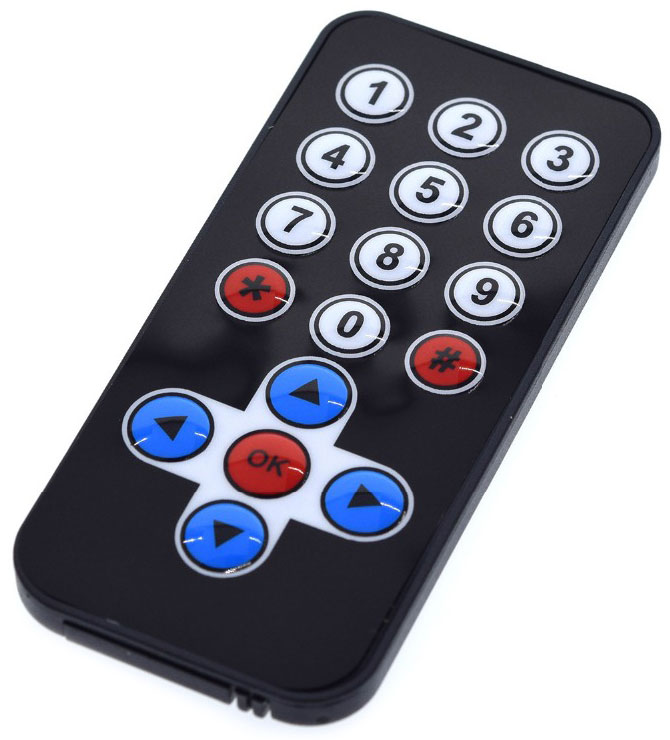
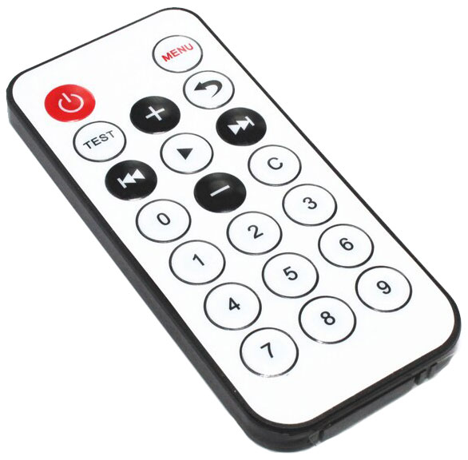
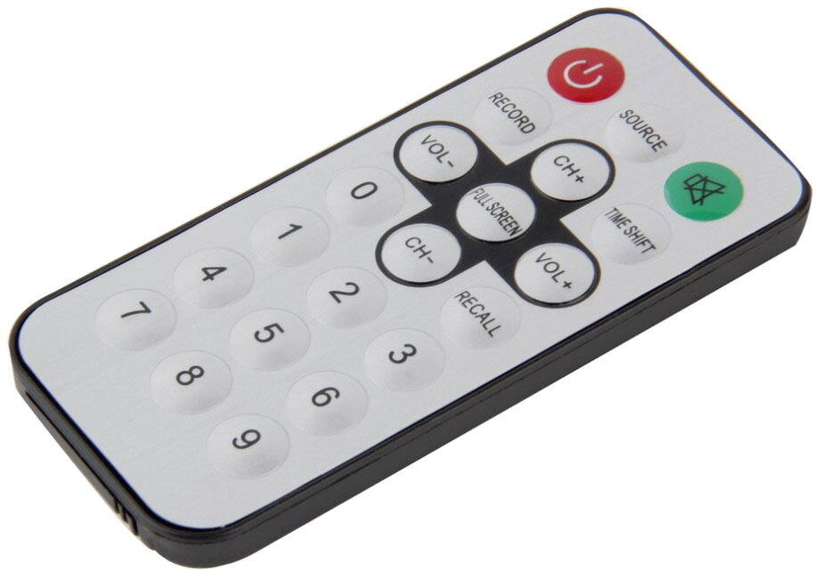
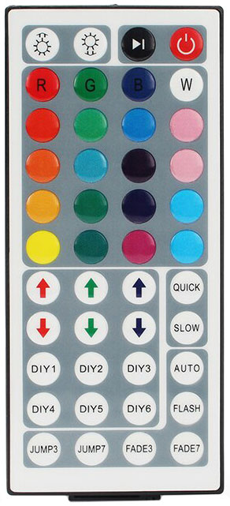

# Remotes

A few of my remotes which I've captured.

#### Black remote with blue d-pad at bottom

[Buy on AliExpress](https://www.aliexpress.com/item/32307163446.html)

Addr High | Addr Low | Command | Button
--------- | -------- | ------- | ------
00        | FF       | 45      | 1
00        | FF       | 46      | 2
00        | FF       | 47      | 3
00        | FF       | 44      | 4
00        | FF       | 40      | 5
00        | FF       | 43      | 6
00        | FF       | 07      | 7
00        | FF       | 15      | 8
00        | FF       | 09      | 9
00        | FF       | 16      | star
00        | FF       | 19      | 0
00        | FF       | 0D      | hash
00        | FF       | 18      | up
00        | FF       | 08      | left
00        | FF       | 1C      | ok
00        | FF       | 5A      | right
00        | FF       | 52      | down

#### White remote with red power button

[Buy on AliExpress](https://www.aliexpress.com/item/32764250708.html)

Addr High | Addr Low | Command | Button
--------- | -------- | ------- | ------
00        | FF       | 45      | power
00        | FF       | 47      | menu
00        | FF       | 44      | test
00        | FF       | 40      | plus
00        | FF       | 43      | back
00        | FF       | 07      | prev
00        | FF       | 15      | play
00        | FF       | 09      | next
00        | FF       | 16      | 0
00        | FF       | 19      | minus
00        | FF       | 0D      | c
00        | FF       | 0C      | 1
00        | FF       | 18      | 2
00        | FF       | 5E      | 3
00        | FF       | 08      | 4
00        | FF       | 1C      | 5
00        | FF       | 5A      | 6
00        | FF       | 42      | 7
00        | FF       | 52      | 8
00        | FF       | 4A      | 9

#### TV tuner silver remote with red power and green mute

[Buy on AliExpress](https://www.aliexpress.com/item/4000068546117.html)

Addr High | Addr Low | Command | Button
--------- | -------- | ------- | ------
00        | FF       | 4D      | power
00        | FF       | 54      | source
00        | FF       | 16      | mute
00        | FF       | 4C      | record
00        | FF       | 05      | ch+
00        | FF       | 0C      | time shift
00        | FF       | 0A      | vol-
00        | FF       | 40      | full screen
00        | FF       | 1E      | vol+
00        | FF       | 12      | 0
00        | FF       | 02      | ch-
00        | FF       | 1C      | recall
00        | FF       | 09      | 1
00        | FF       | 1D      | 2
00        | FF       | 1F      | 3
00        | FF       | 0D      | 4
00        | FF       | 19      | 5
00        | FF       | 1B      | 6
00        | FF       | 11      | 7
00        | FF       | 15      | 8
00        | FF       | 17      | 9

#### 44 key RGB LED remote

[Buy on AliExpress](https://www.aliexpress.com/item/32958464220.html)

Addr High | Addr Low | Command | Button
--------- | -------- | ------- | ------
00        | FF       | 5C      | bright up
00        | FF       | 5D      | bright down
00        | FF       | 41      | next
00        | FF       | 40      | power
00        | FF       | 58      | R
00        | FF       | 59      | G
00        | FF       | 45      | B
00        | FF       | 44      | W
00        | FF       | 54      | r1
00        | FF       | 55      | g1
00        | FF       | 49      | b1
00        | FF       | 48      | w1
00        | FF       | 50      | r2
00        | FF       | 51      | g2
00        | FF       | 4D      | b2
00        | FF       | 4C      | w2
00        | FF       | 1C      | r3
00        | FF       | 1D      | g3
00        | FF       | 1E      | b3
00        | FF       | 1F      | w3
00        | FF       | 18      | r4
00        | FF       | 19      | g4
00        | FF       | 1A      | b4
00        | FF       | 1B      | w4
00        | FF       | 14      | red up
00        | FF       | 15      | green up
00        | FF       | 16      | blue up
00        | FF       | 17      | quick
00        | FF       | 10      | red down
00        | FF       | 11      | green down
00        | FF       | 12      | blue down
00        | FF       | 13      | slow
00        | FF       | 0C      | diy 1
00        | FF       | 0D      | diy 2
00        | FF       | 0E      | diy 3
00        | FF       | 0F      | auto
00        | FF       | 08      | diy 4
00        | FF       | 09      | diy 5
00        | FF       | 0A      | diy 6
00        | FF       | 0B      | flash
00        | FF       | 04      | jump 3
00        | FF       | 05      | jump 7
00        | FF       | 06      | fade 3
00        | FF       | 07      | fade 7
